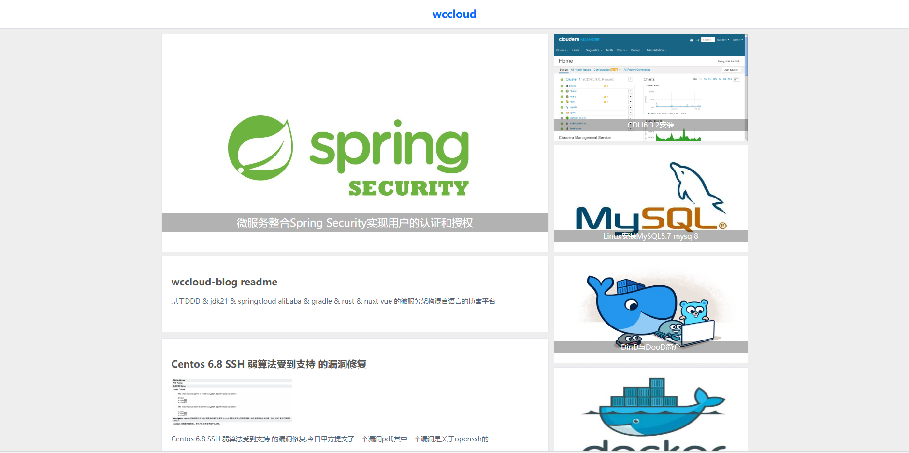
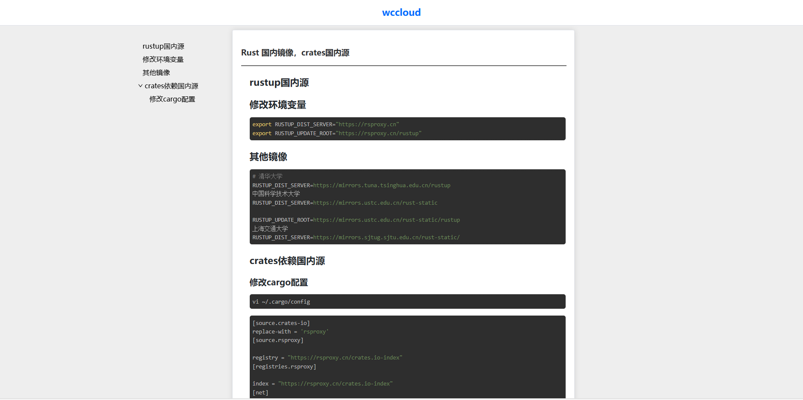
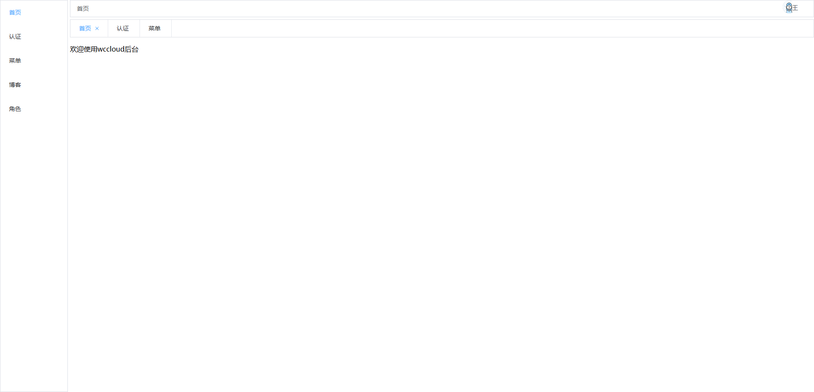
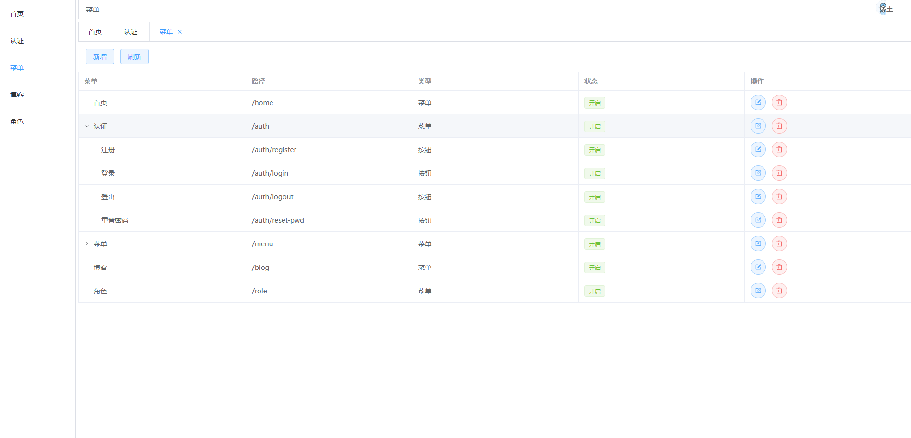
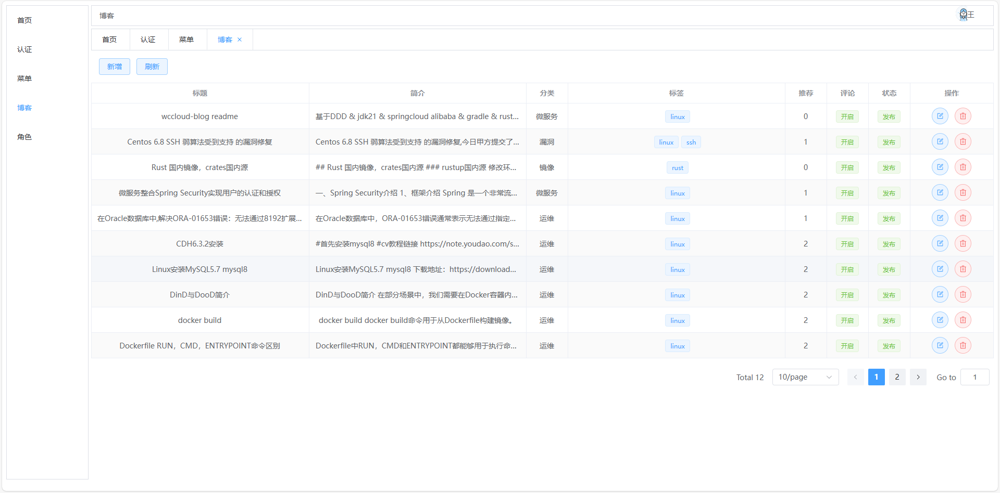
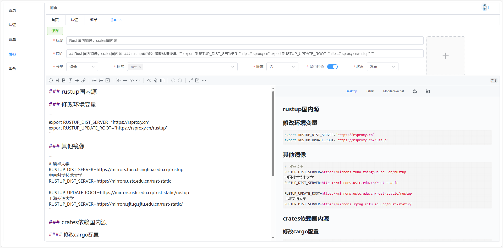
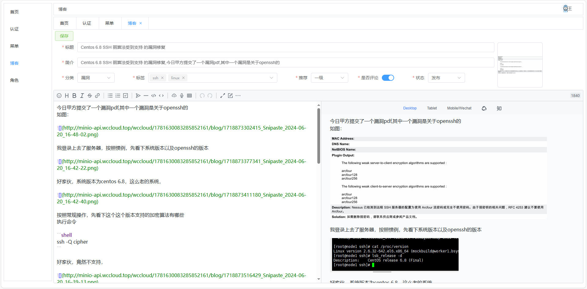
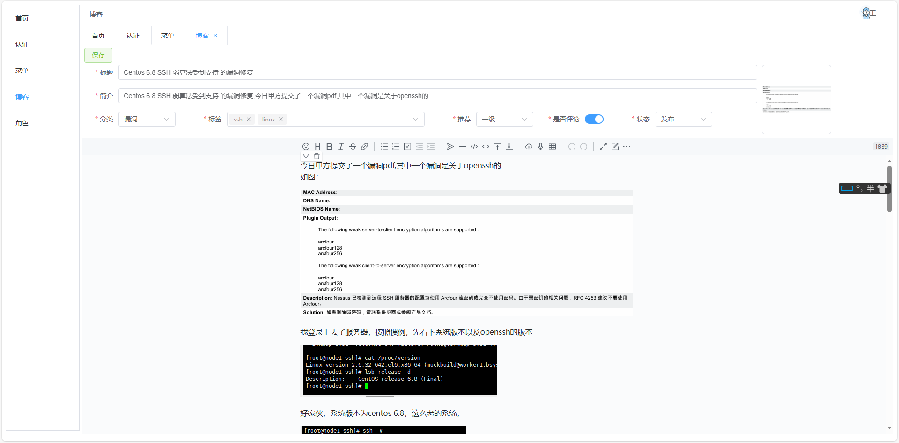
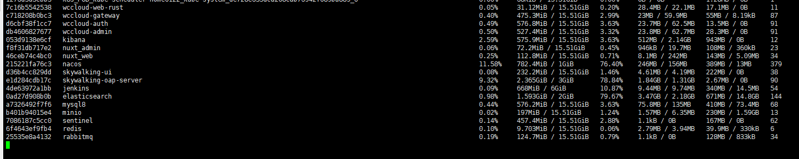

# wccloud-blog

#### 介绍

wccloud-blog 是 基于DDD & jdk21 & springcloud alibaba & gradle & rust & nuxt vue 的微服务架构混合语言的博客平台

#### 软件架构

java 后端采用 gradle, spring cloud alibaba , spring security, spring data redis ,spring cache, mybatisPlus, hibernate-validator, mapstruc, knife4j

rust 后端采用 tokio,actix-web,sea-orm, minio

web 前端采用 nuxt,vue,element-plus,axios , vditor

### 模块说明

common      java后端公共代码，包含公共的异常、返回值、校验组 等

auth        java后端认证服务，包含登录、登出、注册

admin       java后端管理服务，包含菜单

gateway     java后端网关服务，包含统一认证校验

web-rust    rust后端博客服务，包含博客crud,博客门户展示，轮播图，一及推荐，二级推荐，标签，分类

nuxt-admin  nuxt前端后台管理

nuxt-web    nuxt博客门户网站

### blog页面展示

### 后台管理展示

### rust低内存占用真是没的说，如果模块都用rust实现的话，阿里云2c2g服务器就可以随便搞了

目前项目跑在6c16g服务器，后期考虑都用rust替代

